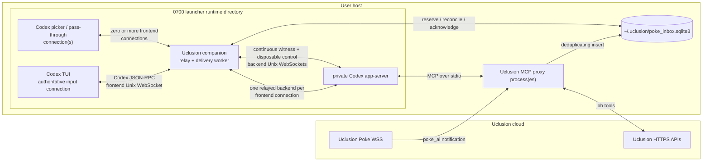
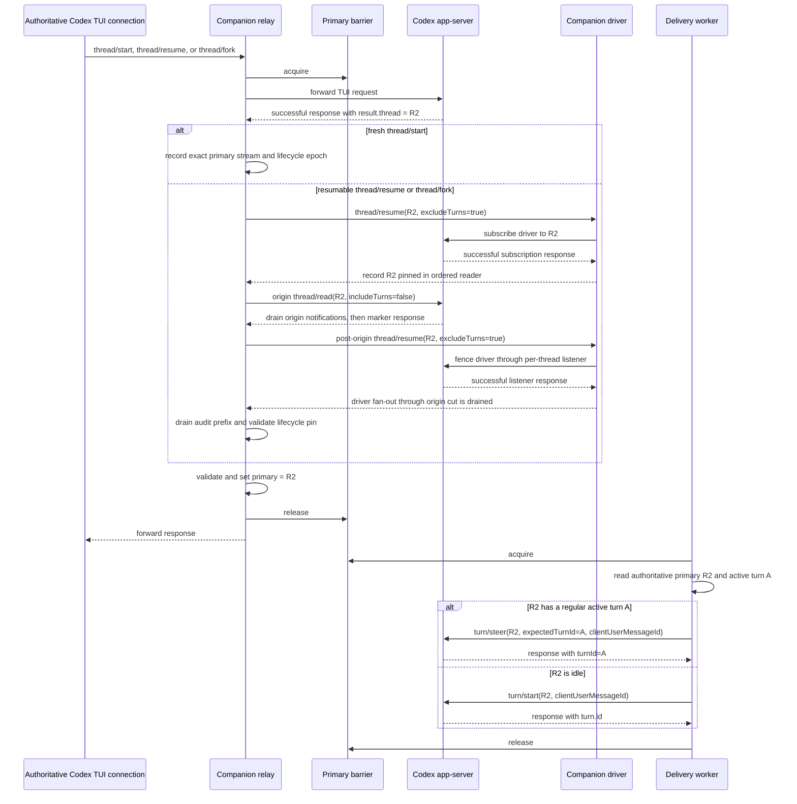

<!-- Copyright (c) 2026 Uclusion, Inc. All rights reserved. -->
# Uclusion Codex Poke companion architecture

This document is the contract for autonomous Poke delivery in a Codex TUI
started by `uclusion codex`. It describes the relay-authoritative design chosen
for J-all-369. The implementation may be organized into classes or threads
differently, but it must preserve the authority and delivery invariants below.

## Scope and vocabulary

- The **primary** is the root Codex thread which owns the user's main input on
  the authoritative TUI connection. It is not necessarily the transcript
  momentarily displayed: `/side` and `/agent` may show another transcript
  without changing where new main-input turns, including Pokes, belong.
- **NoRoot** is the fail-closed authority state in which no thread may receive
  a Poke. It does not discard or advance queued delivery.
- An **auxiliary thread** is any subagent, detached review, helper, or other
  thread which is not that input-owning primary.
- The **companion** is one launcher-owned process. It contains both the
  protocol-aware TUI relay and the durable Poke delivery worker.
- The **frontend** is the private Unix WebSocket accepted by the companion.
  The authoritative TUI connection and any short-lived picker/pass-through
  connections connect only to this socket.
- The **backend** is the private Unix WebSocket accepted by Codex app-server.
  The companion opens one matching relayed backend connection for every
  frontend client, one continuous driver/witness connection, and one
  disposable delivery/control connection.

The companion is necessary because two unrelated WebSocket protocols meet on
the host. Uclusion's cloud WSS carries Poke notifications. Codex app-server
carries bidirectional JSON-RPC in WebSocket frames over a local Unix socket.
Neither protocol can be forwarded directly into the other.

## Components and trust boundaries



There can be more than one Uclusion MCP proxy process. They can receive the
same cloud broadcast; the inbox's environment/workspace/message-id uniqueness
constraint performs local deduplication. Each companion derives a private
`codex-bridge:<instance>` consumer cursor from its launch UUID, so every live
Codex session receives its own copy of Pokes arriving after that session's
startup cutoff. Its reserve, reconciliation, and acknowledgement rows use the
same consumer identity and cannot be handled by another launch.

Multiple companions may run for the same `(environment, workspace)` pair.
Their app-servers, relays, receiver markers, root authorities, and Poke
consumers are all launch-private. One of those companions also holds the
durable SQLite leader row for the workspace-global update-notice stream.
Failure to acquire that row never blocks the frontend or Poke delivery; a
follower simply leaves update notices to the leader and retries leadership on
a five-second cadence. Heartbeat age is diagnostic rather than permission to
steal from a live PID. A dead leader can be replaced, and normal exit releases
its own row.

Update-notice leadership is separate from frontend-connection authority. Each
companion can accept its authoritative TUI connection plus auxiliary picker
connections, while the singleton notice lease prevents two private
app-servers from racing the same global notice's send or reconciliation state.

The runtime directory and its sockets are private against ordinary accidental
access. They are not an authentication boundary against a malicious process
already running as the same operating-system user.

## Why Codex's own serialization is insufficient

Codex 0.145 serializes `turn/start` by target thread. It serializes
`thread/resume` and `thread/fork` by their source thread, while `thread/start`
has no serialization scope. App-server has no concept of the authoritative
TUI connection's input-owning root and therefore no cross-thread primary lock.

A delivery client can consequently pass its last root check, the TUI can
switch to a different root, and app-server can still accept a Poke on the old
loaded root. Repeating root checks narrows that race but cannot close the
interval after the last check. The inline relay closes it because all TUI root
switches and all Poke admissions pass through one companion-owned barrier.

## Primary authority

Primary authority belongs only to an eligible frontend connection which
actually establishes the input-owning root, never to initialization order, a
broadcast notification, or a persisted guess. Successful initialization with
`clientInfo.name = "codex-tui"` records eligibility only. The first eligible
non-auxiliary root request is provisionally elected and serialized. A validated
root response freezes that connection as the owner for the rest of the bridge
session.

Codex also creates ephemeral `threadSource = "system"` threads for internal
task-state work on the primary frontend connection. Those starts and their
later unsubscribes are auxiliary traffic: they must not replace or clear the
human input root.

| Observation | Authority transition |
| --- | --- |
| Successful frontend `initialize` with `clientInfo.name = "codex-tui"` | Mark only that connection as eligible. Initialization does not elect an owner or identify a root. |
| First eligible non-auxiliary `thread/start`, `thread/resume`, or `thread/fork` request before any root commits | Atomically elect that connection provisionally and reserve its root gate before forwarding. |
| Definitive error or validated non-root response to a provisional request | Release its gate without freezing ownership. A later eligible root request may be elected. |
| Successful, correlated, provisionally authoritative root response | Validate `result.thread`, commit its id, and freeze that connection as the primary owner. |
| Later frontend initialization or root request after ownership commits | Allow auxiliary picker/pass-through traffic, but never replace or clear the committed owner. |
| Definitive error response to a committed owner's later root request | Keep the prior primary; Codex rejected the switch. |
| Normal authoritative frontend WebSocket close during `/quit` | Clear authority immediately, stop all new delivery, and make a best-effort Close echo. Preserve the clean classification if the TUI exits before reading that echo. |
| Abrupt authoritative connection loss or an ambiguous/malformed response to one of its primary-changing requests | Clear authority and fail closed. Do not infer which root owns main input. |
| Authoritative `thread/archive` or `thread/delete` for the current primary is in flight | Temporarily enter NoRoot under the barrier so no Poke can target a root being invalidated. |
| Successful authoritative `thread/archive` or `thread/delete` for the current primary | Remain NoRoot until a later correlated start/resume/fork succeeds. |
| Definitive error from that `thread/archive` or `thread/delete` | Restore the prior primary; app-server proved it did not perform the invalidation. An ambiguous transport outcome remains NoRoot. |
| Authoritative `thread/unsubscribe` for the current primary | Enter NoRoot while it is in flight and remain NoRoot on success, definitive RPC error, malformed response, or ambiguous transport. Codex 0.145's TUI aborts its local listener after awaiting unsubscribe even when the RPC returns an error. |
| `thread/archived`, `thread/deleted`, or `thread/closed` for the current primary | Clear authority. |
| `thread/started`, `thread/status/changed`, or `thread/loaded/list` | Never establish or replace the primary. These are not display evidence. |
| A companion-originated resume/read, detached `review/start`, subagent event, or auxiliary lifecycle notification | Never establish or replace the primary. |

A valid primary response contains a root thread for the launcher's exact
canonical workspace: non-empty `id`, `sessionId == id`, no `parentThreadId`,
and a matching canonical `cwd`. Durable recovery is supported for
non-ephemeral primaries. An ephemeral thread has no persisted rollout, so an
app-server process crash cannot be reconciled from history; it must not be
described as crash-recoverable.

Before ownership commits, any successfully initialized `codex-tui` connection
may become the provisional owner through its serialized non-auxiliary root
request. After commit, auxiliary frontend connections can relay picker, read,
and other pass-through traffic with their own matching backend connections.
Even if one observes or loads a thread, its response cannot alter the authoritative
binding. Any attempt by a second connection to admit a turn on the primary,
invalidate the primary, interrupt or steer the primary's turn, claim
authority, or perform another authoritative primary mutation is rejected or
fails closed. Auxiliary root traffic may load or create a different thread,
but it must never create two input owners.

## Root witness, lifecycle fencing, and audit continuity

A successful Codex root response can receive Pokes without any historical MCP
startup notification. That status describes Codex's tool-server initialization,
not app-server turn admission. The companion verifies only that the selected
root still has a live lifecycle witness.

Every committed primary root records the lifecycle epoch proven by its own
correlated response. An auxiliary event that advances that epoch makes the
current primary stale. A later auxiliary handoff may re-pin the driver, but it
cannot advance the primary's recorded epoch or reopen delivery.

A fresh `thread/start` has no rollout that another app-server connection can
resume before the first turn. The exact primary relay connection therefore
witnesses that root until a later resumable handoff. Delivery requires the same
live primary and lifecycle epoch. Losing either blocks delivery and the
authoritative lifecycle event revokes the root.

A resumed or forked root is subscribed on the companion driver before its
response commits to the TUI. The handoff remains serialized with root changes
and Poke admission. It performs these ordered steps:

1. Subscribe the driver and confirm the root pin at the expected lifecycle
   epoch.
2. Fence the originating connection with a thread read, observing every
   lifecycle and token-audit notification that preceded driver attachment.
3. Fence the driver's listener so delayed fan-out copies cannot overtake the
   handoff.
4. Recheck the lifecycle epoch and driver pin, then commit the root response.

A lifecycle copy arriving first on an auxiliary connection clears the driver
pin immediately and leaves the current primary bound to its old epoch.
Delivery remains blocked even if another auxiliary handoff re-pins the driver.
Only a later authoritative primary root response can establish the new epoch.
Closing or unsubscribing an auxiliary connection does not remove an otherwise
current independent driver pin.

The same two-fence handoff preserves token-audit order. Notifications from a
fresh primary remain the audit prefix while driver copies are buffered. After
both streams are fenced, the companion drains the buffered driver suffix and
makes the driver the sole audit witness. The driver connection fails the live
session closed if it disconnects because a replacement connection is not
retroactively subscribed to loaded roots.

MCP startup-status notifications are not root-authority input. Missing,
`starting`, `ready`, `failed`, and `cancelled` statuses neither block nor
release Pokes.

## Switch-versus-Poke serialization

The companion uses one barrier for primary-changing TUI requests and Poke
delivery. The barrier covers app-server acceptance, not the whole generated
turn.



The matching authoritative response is parsed and authority is updated before
that response is forwarded to the TUI. If the switch acquires the barrier
first, the Poke targets the new primary. If delivery acquires it first,
app-server accepts the Poke on the old primary before the switch request is
forwarded. After the `turn/start` or `turn/steer` response, the barrier is
released. An intentional later main-input switch is allowed and can hide a
still-running Poke turn. Merely viewing `/side` or `/agent` does not enter this
race because it does not change the input-owning primary.

The primary frontend uses one outbound FIFO. Its admission ticket is recorded
synchronously before a message is handed to the worker, so a Poke cannot slip
between frontend receipt and worker scheduling. Root changes, current-root
invalidation, and human turn-admission methods hold the barrier through their
correlated response. Ordinary requests and notifications retain arrival
order. Only `turn/interrupt`, `turn/steer`, and a correlated response to a
backend-initiated request bypass the FIFO; those paths must stay live to
control or answer an already-running turn.

The relay is protocol-aware, not byte-transparent. It preserves JSON-RPC
requests, responses, notifications, server-initiated requests, WebSocket
control frames, and message ordering while tracking correlated request ids.
Notifications such as `thread/started` may arrive before the matching response;
they do not commit authority. IDs are limited to strings and signed 64-bit
integers, responses require exactly one of `result` or an object-valued
`error`, JSON numbers must be finite, and malformed WebSocket control frames
fail closed.

## Durable delivery

Delivery is reserve/acknowledge rather than destructive consumption.

```mermaid
sequenceDiagram
    participant P as MCP proxy
    participant Q as Durable inbox
    participant C as Companion
    participant A as Codex app-server
    participant T as Visible TUI

    P->>Q: INSERT OR IGNORE Poke by message id
    C->>C: require live TUI and authoritative primary
    C->>Q: peek next codex-bridge:&lt;instance&gt; sequence
    C->>Q: record delivery state = sending
    alt primary has a regular active turn
        C->>A: turn/steer(primary, expectedTurnId, clientUserMessageId)
        A-->>C: result.turnId
    else primary is idle
        C->>A: turn/start(primary, clientUserMessageId)
        A-->>C: result.turn.id
    end
    C->>Q: acknowledge and advance this instance's cursor
    A-->>C: later item/completed userMessage(clientId)
    C-->>T: relay turn/item notifications
```

The companion does not peek, reserve, reconcile, or advance the cursor while
there is no live authoritative primary or while that primary lacks its current
primary or driver lifecycle witness. It tracks the primary's active turn from
authoritative lifecycle responses plus `turn/started` and matching
`turn/completed` notifications. A regular active turn receives the Poke
through `turn/steer`, exactly like pressing Enter in Codex; an idle primary
receives a new `turn/start`. `expectedTurnId` makes a completion, interruption,
or replacement race a definitive rejection rather than a misdirected steer.
Review and manual-compaction turns cannot be steered, so their Pokes remain
durably pending until the primary can accept them. Update notices remain
idle-only. A successful human admission response can precede both
`turn/started` and the thread's status transition; the relay preserves that
provisional-busy state for turns, inline reviews, and manual compactions so
delivery cannot enqueue a competing `turn/start` in the gap. A shell command
is either auxiliary to an active turn or a regular standalone turn; a queued
start may safely join the latter, so it does not leave a provisional barrier.

A valid `turn/start` or `turn/steer` response is the cursor acknowledgement.
Codex returns it only after accepting or queueing the submission, so normal
delivery does not wait for the model turn or a later `item/completed`. The
authoritative subscription still keeps a bounded exact-correlation cache, and
complete persisted history remains the recovery evidence when an RPC outcome
is missing, timed out, malformed, mismatched, or loses authority before the
local acknowledgement commits.

After acknowledging a companion `turn/start`, the bridge records its returned
turn as provisionally active before releasing the delivery lease. It does so
only when the root snapshot is still current and no `turn/started` or
`turn/completed` event advanced the snapshot's event serial during the RPC. A
racing event therefore wins and cannot be overwritten. Until Codex exposes the
new turn as active, a following Poke waits instead of issuing a competing
`turn/start`; it then uses `turn/steer` on the established active turn.

When there is no pending Poke, update notice, or ambiguous send to reconcile,
the companion does not poll `thread/read`. Authoritative relay state already
identifies the current root and active turn, while a read-only inbox preflight
determines whether a control RPC is needed.

Every ordinary `uclusion codex` launch creates its private consumer and applies
an atomic startup cutoff before publishing readiness. It advances only that
`codex-bridge:<instance>` cursor through the highest Poke already present. An
enqueue serialized after the transaction remains pending and is delivered to
that launch normally. Stored Pokes, update notices, and all other consumer
cursors are untouched. The cursor is heartbeat-refreshed while its companion
is live, removed with its delivery rows on normal exit, and pruned with those
rows after the seven-day retention window only when its recorded owner PID is
no longer live. The cutoff is committed once, so a later frontend or TUI
startup failure does not turn its pre-launch backlog into live work.

The explicit launcher option `uclusion codex --deliver-existing-pokes` is the
sole exception. It omits the startup cutoff for the new launch consumer, so
that session receives retained rows as a private copy before later Pokes. A
prior launch's cursor and ambiguous delivery records remain isolated; this
explicit replay can therefore duplicate a Poke that the prior session accepted
without durably acknowledging before it died.

If the disposable control transport fails after a send, the outcome is
ambiguous. The `sending` record retains the message id, thread id, admission
method, provisional target when known, launcher/app-server instance, attempt
count, and dedicated attempt-start time. The attempt-start floors are 1, 2, 4,
then 5 seconds capped. Time already spent in the ten-second RPC timeout counts
toward the floor. A legacy row without the timestamp is immediately due after
reconciliation. When due, the companion reads that stored thread's complete
history, using full-item pagination through EOF when required, even if the TUI
has since selected another primary:

- If one or more persisted user items have the same client id, acknowledge the
  old attempt. Multiple matches emit one diagnostic but never wedge delivery.
  Requiring the old thread to remain current here would risk another copy on
  the new primary.
- If complete history has no match, resolve the current leased root and turn,
  then recheck the live exact-id cache. Atomically replace the same `sending`
  row with its incremented attempt, current target, and new start time before
  resending the same sequence and message id in that delivery pass. There is
  no intermediate pending state. Do this even while the old provisional
  target remains active and without waiting for process turnover.
- If turns are unavailable or root/status/turn/item shape is malformed, keep
  the row `sending` and fail closed.

The final cursor acknowledgement is a conditional commit under the same
authority lock used by disconnect and lifecycle invalidation. Either the
snapshot and visible receiver are still current and SQLite commits first, or
revocation wins and the `sending` row remains for reconciliation. There is no
check-then-commit window in which a stale root can advance the cursor.

This is duplicate suppression within one `codex-bridge:<instance>` consumer,
not a claim of global exactly-once delivery. Other named consumers have
independent cursors, and the same Poke is intentionally delivered to Claude,
Cursor, and every other active Codex session. Inbox rows age out after seven
days.

Update notices use the same primary authority and serialization barrier, but
retain their existing exact-item commit gate and causal ambiguous-send
recovery. They wait
for idle rather than steering an active user turn.

## Interactive requests and auxiliary connections

The authoritative relayed TUI connection remains the interactive input owner
and thread subscriber. It renders streamed events and answers app-server
requests for command approval, file approval, user input, permissions, and
other elicitation. Picker/pass-through and companion driver connections never
auto-approve, deny, or fabricate an answer. Receiving a server request on an
auxiliary connection is not permission to resolve it.

Each backend WebSocket performs its own `initialize` request followed by the
`initialized` notification. Their JSON-RPC request-id spaces are independent.
Activity initiated by a picker/pass-through or delivery connection does not
change primary authority. Backend-initiated requests on a relayed TUI
connection use a separate pending-id map; only the matching TUI response is
returned, even while a root or admission request is gated. Codex duplicates
thread-scoped server requests to subscribed connections; the noninteractive
driver deliberately leaves its copy unanswered so only the relayed TUI's
human response resolves it. The driver processes lifecycle and token-audit
notifications in place while discarding unrelated broadcasts, so they cannot
create a memory backlog or establish primary authority.

## Failure and recovery

| Failure or state | Required behavior |
| --- | --- |
| No authoritative TUI connection or no authoritative primary | Leave inbox and delivery rows untouched. |
| The current primary's recorded lifecycle epoch becomes stale, a fresh primary loses its exact primary witness, or a resumed primary loses its driver pin | Keep the delivery gate closed and leave inbox and delivery rows untouched until a new authoritative primary response establishes the current epoch or authoritative lifecycle handling revokes the root. |
| Primary has a regular active turn | Steer the next Poke into that turn with its durable message id and the tracked `expectedTurnId`. |
| Primary has an active review or manual compaction | Keep the Poke pending and deliver after the non-steerable turn changes or ends. |
| Primary is active but its turn id is untracked after a response/event ordering conflict | Resolve the sole in-progress turn from complete history, then steer with `expectedTurnId`; defer or fail closed if it cannot be proved. |
| A successful human admission response precedes `turn/started` and thread status still reads idle | Treat the primary as provisionally busy; do not reserve or send another `turn/start`. |
| Authoritative TUI sends a normal frontend WebSocket close during `/quit` | Revoke delivery authority immediately and nonfatally, make a best-effort Close echo, and preserve the clean classification if the TUI exits before reading that echo. |
| Authoritative TUI/frontend connection ends abruptly, sends an error Close code, or violates the WebSocket/JSON-RPC protocol | Revoke delivery authority immediately, send a bounded best-effort Close 1011, and fail closed. |
| Eligible picker/pass-through connection opens before a root commits | Initialization alone changes nothing. Its first serialized root request may be provisionally elected; a validated root response freezes ownership. |
| Auxiliary picker/pass-through connection opens, unsubscribes, or closes after ownership commits | Allow and isolate it; never change authority. Complete any in-flight origin fence before retirement. The independent driver pin remains current. |
| A second connection attempts primary turn admission, control, or current-primary invalidation | Reject that request on the auxiliary connection; never let it bypass a Poke lease. |
| A primary message is queued before its FIFO worker runs | Its synchronous reservation blocks new Poke leases; interrupt, steer, and correlated server responses remain immediate. |
| Root-switch request returns an error | Keep the previous primary. |
| Root-switch outcome is ambiguous | Clear primary and wait for a fresh correlated TUI start/resume/fork. |
| Current-primary archive/delete returns a definitive error | Restore the prior primary. Success or an ambiguous outcome leaves NoRoot. |
| Current-primary unsubscribe succeeds, errors, or has an ambiguous outcome | Leave NoRoot because the TUI abandons its listener after awaiting the call regardless of the RPC result. |
| A second launcher targets the same environment and workspace | Start it with a private runtime and `codex-bridge:<instance>` cursor; both sessions receive post-cutoff Pokes independently. |
| The update-notice leader PID is live | Followers continue their own Poke delivery but never read or mutate the global notice stream. |
| The update-notice leader PID is dead | Permit a follower to take leadership and recover or reconcile global notice state. A stale heartbeat alone never permits takeover. |
| Disposable control connection fails or times out | Preserve any `sending` row, keep the continuous driver witness intact, reconnect control to the still-running backend, then reconcile by the stored message and thread ids. |
| Relayed backend connection fails | Clear authority and close or fail the frontend; never reconstruct visibility from broadcasts or loaded-thread lists. |
| Malformed recognized thread-lifecycle witness notification on the primary or driver | Fail the bridge session closed; never use partial lifecycle evidence. |
| Companion driver/witness connection fails after initialization | Fail the bridge session closed. A replacement driver is not retroactively subscribed to already-loaded roots and cannot safely inherit their lifecycle or audit stream. |
| Companion exits | Launcher stops the TUI and app-server. Unacknowledged inbox state remains for a later launch. |
| App-server exits | Launcher stops the companion and TUI. A later launch may reconcile persisted non-ephemeral history; it cannot prove an ephemeral turn survived. |
| Launcher parent exits or the authoritative TUI dies | Stop delivery before the next peek/send and reap launcher-owned children. |
| Duplicate cloud notification | Inbox uniqueness suppresses the duplicate for the same environment, workspace, and message id. |
| Admission RPC returns a valid successful response | Acknowledge immediately and advance the cursor under the current root lease; do not wait for a user item or model-turn completion. |
| A second Poke arrives between a successful `turn/start` response and its turn event | Preserve the response turn as provisional under the unchanged event serial, wait through any still-idle read, then steer into the established turn. |
| Admission outcome remains ambiguous and its retry floor expires | Reconcile complete exact-id history. A match acknowledges; absence retries the same id immediately on the current leased root. |
| Complete history contains multiple exact client-id matches | Acknowledge once, advance the cursor, and emit a duplicate diagnostic instead of wedging. |
| SQLite, app-server history, response correlation, or authority at commit cannot be proved | Fail closed and keep the delivery unacknowledged; do not advance the cursor. |

Authority is never restored from a persisted binding after a transport or
process boundary. A new authoritative TUI connection must demonstrate its
primary with a successful correlated lifecycle response.

## Install, launch, and shutdown

An install or update publishes the CLI, MCP proxy, and companion as one
immutable release. Older releases installed a marker-owned lifecycle-hook
block in `~/.codex/config.toml`; current installers remove only that exact
`# uclusion-codex-bridge-hooks:v1` block and preserve unrelated hooks and
configuration. A symlink-managed config remains a symlink and its regular-file
target is updated atomically. The installer serializes its own writers and
checks target identity plus contents both before and after preparing the
replacement, so detected retargets or concurrent edits abort. Python has no
portable conditional-rename primitive for the final check-to-publication
instant; arbitrary noncooperating editors in that instant remain the standard
very narrow limitation of atomic temp-file replacement. Poke delivery has no
`/hooks` trust prerequisite.

`uclusion codex` performs these steps:

1. Validate workspace configuration and the Codex version.
2. Stage one immutable Uclusion release in a new private runtime directory.
3. Start Codex app-server on the private backend Unix socket.
4. Start the companion and acquire exclusive bridge ownership. Establish its
   atomic backlog cutoff now unless `--deliver-existing-pokes` was requested.
5. Initialize the companion's continuous driver/witness connection and its
   disposable control connection, then bind the private frontend Unix socket.
   The driver is therefore available for an explicit subscription before any
   TUI root response can be released, while control recovery cannot revoke
   that root witness.
6. Start the TUI with `--remote` pointing to the frontend, never the backend.
7. Record successfully initialized `codex-tui` connections as eligible. Elect
   and reserve the first eligible non-auxiliary root request, then freeze its
   connection only after the validated root commits. Its fresh `thread/start`
   stream witnesses that root directly. Hold every successful resumable
   `thread/resume` or `thread/fork` response, including auxiliary picker
   responses, until the driver has explicitly subscribed to and fenced its
   returned thread. Auxiliary picker connections may then come and go without
   unloading that pinned runtime.

Global config and feature passthrough flags (`-c`/`--config`, `--enable`,
`--disable`, and `--strict-config`) are copied to the backend as well as the
TUI, while the launcher's complete Uclusion MCP table is appended afterward
so a passthrough override cannot disconnect this workspace's proxy.

Process readiness and delivery readiness are different. A readiness marker can
prove that the companion initialized and bound its frontend; it cannot prove a
TUI is connected or that a primary exists.

The launcher owns the app-server, companion, and TUI as one lifetime. If any
required child exits unexpectedly, it stops and reaps the others. Runtime
sockets and staged files disappear with that lifetime. A normal authoritative
frontend WebSocket close from `/quit` is echoed and is not a companion failure:
it revokes delivery authority nonfatally while the launcher follows the TUI's
clean exit and performs normal cleanup. Abrupt transport loss, error Close
codes, and malformed or invalid close/protocol traffic remain fatal.

## Codex protocol compatibility

The integration uses Codex's local Unix-socket WebSocket control plane. Codex's
TCP WebSocket listener is documented as experimental/unsupported and is not
part of this design.

The launcher currently requires Codex 0.145.0 or newer. Its request/response
validation and sequencing rules target the 0.145.0 schemas and observed TUI
behavior. App-server schemas are version-specific and the app-server is
documented as a development interface that may change. A minimum-version check
is therefore not a promise that every future Codex version remains
wire-compatible. Unknown or malformed lifecycle and turn responses must fail
closed, and compatibility tests should be rerun when Codex changes.

## Verification matrix

At minimum, tests must cover:

- initialization remaining eligibility-only, competing eligible root requests
  being elected and reserved atomically, and the first validated root freezing
  ownership even through a later NoRoot state;
- `thread/start`, `thread/resume`, and `thread/fork` winning and losing the
  barrier race against a Poke;
- authority update before the TUI receives a successful switch response;
- disconnect and ambiguous-switch authority revocation;
- an actual proxy-persisted Poke reaching a resumed primary through the bridge
  and relay without any MCP startup-status notification, plus an unchanged
  root-witness blocker being reported once without reserving or advancing it;
- fresh-primary audit routing until a rollout exists, followed by ordered
  driver cutover with the origin fence, driver listener fence, and buffered
  audit suffix;
- resumed-root driver subscription, exact `excludeTurns=true`, origin and
  driver fence failure/timeout, lifecycle-epoch validation, atomic pin recheck
  at primary commit, and clean Close during a held handoff remaining nonfatal;
- an auxiliary-first lifecycle copy clearing the driver pin and blocking Poke
  delivery, an auxiliary re-pin remaining unable to reopen a stale resumed
  primary, lifecycle tombstone ordering across subscribers and clock
  regression, and auxiliary unsubscribe/close preserving an independent
  driver pin;
- driver loss and malformed driver lifecycle events failing the session closed,
  while duplicate thread-scoped server requests remain unanswered for the TUI;
- archive/delete success and ambiguity clearing authority, with definitive
  errors restoring the prior primary;
- unsubscribe success, definitive error, malformed response, and ambiguous
  transport all leaving NoRoot, plus close of the current primary;
- detached reviews, subagents, lifecycle broadcasts, and auxiliary resumes
  never stealing primary authority;
- auxiliary picker/pass-through coexistence without authority mutation;
- rejection or fail-closed handling of a second connection's attempted
  turn admission or current-primary invalidation;
- enqueue-to-worker FIFO races, ordinary-message ordering, and explicit
  interrupt/steer/server-response bypass;
- same-workspace companions becoming ready together, independent launch
  cutoffs and Poke delivery/reconciliation, plus singleton update-notice
  leadership with dead-owner takeover and no heartbeat-only ownership theft;
- active-turn Poke steering, authoritative active-turn tracking, expected-turn
  races, non-steerable deferral, and ordered stacked Pokes;
- response-before-lifecycle gaps for ordinary turns, inline reviews, and
  manual compactions remaining provisionally busy, without an active shell
  command leaving a stale barrier;
- immediate cursor acknowledgement from valid start and steer responses,
  response-to-event provisional state preventing a second start, authority
  revocation before that local commit leaving an ambiguous row, and a queued
  start joining a racing regular turn;
- ambiguous `turn/start` and `turn/steer` recovery against the stored old
  thread after a later primary switch, including complete paginated history
  plus 1/2/4/5-second capped attempt spacing, same-id retry while the old target
  remains active, late-match suppression, and duplicate-client-id
  acknowledgement with a diagnostic;
- idle delivery steps issuing no app-server metadata read, and a disposable
  control timeout reconnecting without replacing or invalidating the
  continuous driver witness;
- WebSocket fragmentation, ping/pong, strict close validation, finite and
  duplicate-free JSON, exact response envelopes, signed-int64/string request
  ids, and bidirectional correlation without protocol reordering;
- a normal frontend close from `/quit` revoking authority nonfatally even when
  the peer exits before reading its Close echo, while error Close codes,
  abrupt loss, and protocol-invalid disconnects remain fatal and receive a
  bounded best-effort Close 1011;
- malformed reconciliation history remaining `sending`, plus cursor
  acknowledgement serialized against lifecycle and disconnect revocation;
- duplicate cloud notifications and independent consumer cursors;
- per-launch atomic startup cutoff, `--deliver-existing-pokes` private-copy
  opt-in, heartbeat retry, PID-gated stale cleanup, fail-closed cursor loss,
  graceful consumer cleanup, and isolation from later Pokes plus other
  consumers;
- launcher cleanup for TUI, companion, and app-server failure; and
- a real end-to-end Poke plus `/new` interleaving against a supported
  Codex release.
