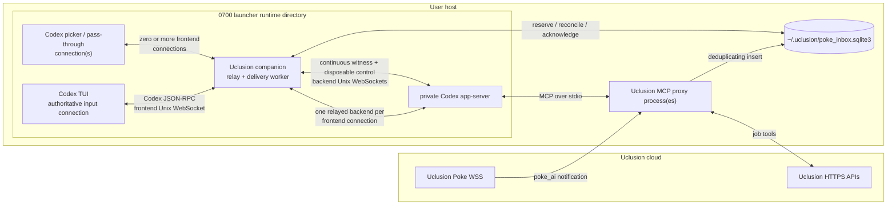
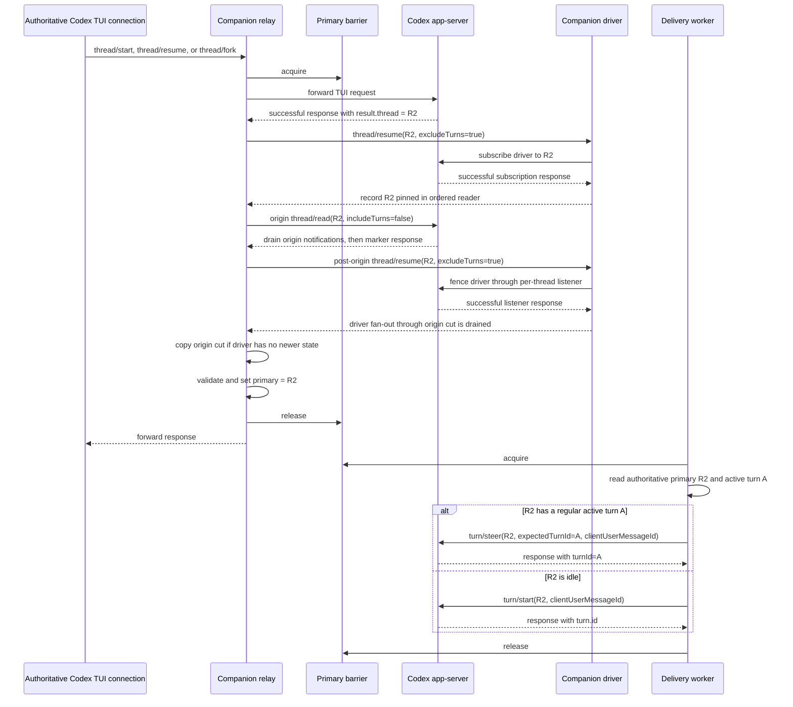
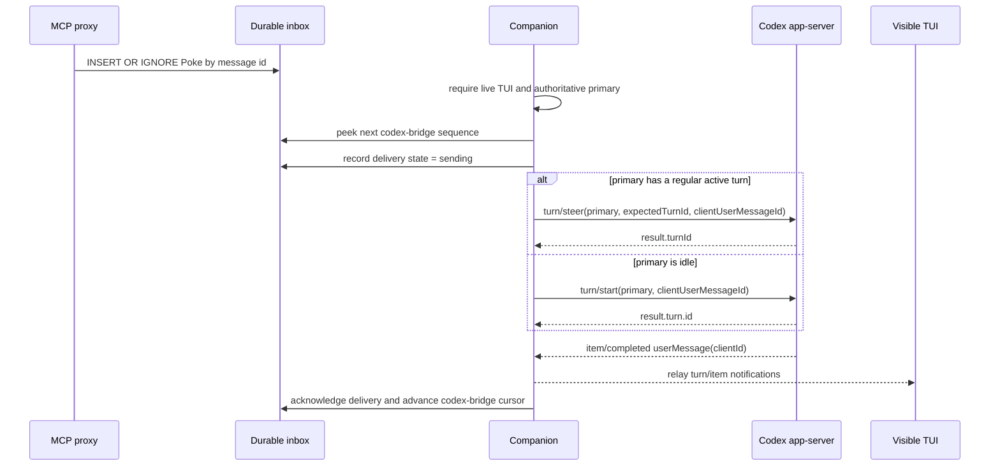

<!-- Copyright (c) 2026 Uclusion, Inc. All rights reserved. -->
# Uclusion Codex Poke companion architecture

This document is the contract for autonomous Poke delivery in a Codex TUI
started by `uclusion codex`. It describes the relay-authoritative design chosen
for J-all-369. The implementation may be organized into classes or threads
differently, but it must preserve the authority and delivery invariants below.

## Scope and vocabulary

- The **primary** is the root Codex thread which owns the user's main input on
  the authoritative TUI connection. It is not necessarily the transcript
  momentarily displayed: `/side` and `/agent` may show another transcript
  without changing where new main-input turns, including Pokes, belong.
- **NoRoot** is the fail-closed authority state in which no thread may receive
  a Poke. It does not discard or advance queued delivery.
- An **auxiliary thread** is any subagent, detached review, helper, or other
  thread which is not that input-owning primary.
- The **companion** is one launcher-owned process. It contains both the
  protocol-aware TUI relay and the durable Poke delivery worker.
- The **frontend** is the private Unix WebSocket accepted by the companion.
  The authoritative TUI connection and any short-lived picker/pass-through
  connections connect only to this socket.
- The **backend** is the private Unix WebSocket accepted by Codex app-server.
  The companion opens one matching relayed backend connection for every
  frontend client, one continuous driver/witness connection, and one
  disposable delivery/control connection.

The companion is necessary because two unrelated WebSocket protocols meet on
the host. Uclusion's cloud WSS carries Poke notifications. Codex app-server
carries bidirectional JSON-RPC in WebSocket frames over a local Unix socket.
Neither protocol can be forwarded directly into the other.

## Components and trust boundaries

There can be more than one Uclusion MCP proxy process. They can receive the
same cloud broadcast; the inbox's environment/workspace/message-id uniqueness
constraint performs local deduplication. The companion has its own
`codex-bridge` consumer cursor. Other consumers intentionally receive their own
copy of a Poke.

Exactly one live companion may own a given `(environment, workspace)` pair.
It acquires a durable SQLite ownership row before enabling its frontend or
delivery worker and refreshes that row while alive. A second launcher for the
same pair is rejected while the recorded owner PID is live. Heartbeat age is
diagnostic rather than permission to steal: a stalled old owner could otherwise
wake and race the replacement. A dead PID can be replaced, and a normal exit
releases its own row. Launchers for different environments or workspaces may
coexist.

This launcher lock is separate from frontend-connection authority: one live
companion can accept its authoritative TUI connection plus auxiliary picker
connections. The process-level lock is needed because all companions for the
same pair would share the `codex-bridge` cursor. Allowing two live companions
to map that stream to different input-owning roots could produce competing
`turn/start` attempts, duplicate a Poke before either owner acknowledges it, or
make ambiguous-send reconciliation race the wrong primary.

The runtime directory and its sockets are private against ordinary accidental
access. They are not an authentication boundary against a malicious process
already running as the same operating-system user.

## Why Codex's own serialization is insufficient

Codex 0.145 serializes `turn/start` by target thread. It serializes
`thread/resume` and `thread/fork` by their source thread, while `thread/start`
has no serialization scope. App-server has no concept of the authoritative
TUI connection's input-owning root and therefore no cross-thread primary lock.

A delivery client can consequently pass its last root check, the TUI can
switch to a different root, and app-server can still accept a Poke on the old
loaded root. Repeating root checks narrows that race but cannot close the
interval after the last check. The inline relay closes it because all TUI root
switches and all Poke admissions pass through one companion-owned barrier.

## Primary authority

Primary authority belongs only to the first frontend connection which
successfully initializes with `clientInfo.name = "codex-tui"`, never to a
broadcast notification or a persisted guess. It is memory-only and starts as
unknown when that authoritative connection is established. Later frontend
connections are auxiliary pass-through connections, including pickers opened
by commands such as `/resume`; they may coexist but cannot mutate authority.

| Observation | Authority transition |
| --- | --- |
| First successful frontend `initialize` with `clientInfo.name = "codex-tui"` | Designate that connection authoritative but keep primary unknown. Initialization alone does not identify its input-owning root. |
| Later frontend initialization, including a picker/pass-through connection | Allow it as auxiliary. Its requests and responses never establish, replace, or clear primary authority. |
| Successful, correlated, authoritative-connection `thread/start`, `thread/resume`, or `thread/fork` response | Validate `result.thread`, then atomically replace the primary with its id. |
| Definitive error response to one of those authoritative requests | Keep the prior primary; Codex rejected the switch. |
| Normal authoritative frontend WebSocket close during `/quit` | Clear authority immediately, stop all new delivery, and make a best-effort Close echo. Preserve the clean classification if the TUI exits before reading that echo. |
| Abrupt authoritative connection loss or an ambiguous/malformed response to one of its primary-changing requests | Clear authority and fail closed. Do not infer which root owns main input. |
| Authoritative `thread/archive` or `thread/delete` for the current primary is in flight | Temporarily enter NoRoot under the barrier so no Poke can target a root being invalidated. |
| Successful authoritative `thread/archive` or `thread/delete` for the current primary | Remain NoRoot until a later correlated start/resume/fork succeeds. |
| Definitive error from that `thread/archive` or `thread/delete` | Restore the prior primary; app-server proved it did not perform the invalidation. An ambiguous transport outcome remains NoRoot. |
| Authoritative `thread/unsubscribe` for the current primary | Enter NoRoot while it is in flight and remain NoRoot on success, definitive RPC error, malformed response, or ambiguous transport. Codex 0.145's TUI aborts its local listener after awaiting unsubscribe even when the RPC returns an error. |
| `thread/archived`, `thread/deleted`, or `thread/closed` for the current primary | Clear authority. |
| `thread/started`, `thread/status/changed`, or `thread/loaded/list` | Never establish or replace the primary. These are not display evidence. |
| A companion-originated resume/read, detached `review/start`, subagent event, or auxiliary lifecycle notification | Never establish or replace the primary. |

A valid primary response contains a root thread for the launcher's exact
canonical workspace: non-empty `id`, `sessionId == id`, no `parentThreadId`,
and a matching canonical `cwd`. Durable recovery is supported for
non-ephemeral primaries. An ephemeral thread has no persisted rollout, so an
app-server process crash cannot be reconciled from history; it must not be
described as crash-recoverable.

Auxiliary frontend connections can relay picker, read, and other pass-through
traffic with their own matching backend connections. Even if one observes or
loads a thread, its response cannot alter the authoritative binding. Any
attempt by a second connection to admit a turn on the primary, invalidate the
primary, interrupt or steer the primary's turn, claim authority, or perform
another authoritative primary mutation is rejected or fails closed. Auxiliary
`thread/start`, `thread/resume`, and `thread/fork` picker traffic may load or
create a different thread, but it must never create two input owners.

## MCP startup readiness

Establishing the authoritative root is necessary but not sufficient for Poke
delivery. Delivery requires three facts: a live companion driver, a driver pin
for that exact root, and authoritative thread-scoped `Uclusion` status
`ready`, `failed`, or `cancelled`. Only the primary TUI stream and the
companion driver participate in that delivery status. Raw picker observations
are handoff input, never evidence that can open the gate by themselves.
Before the relay accepts any TUI, the companion initializes its separate
driver connection. That connection is the continuous notification witness and
is used only for subscription acknowledgements and listener fences. A second,
disposable control connection owns delivery and history RPCs. A slow or failed
control request can therefore be closed and retried without falsely declaring
that the continuously subscribed witness disappeared. Codex's automatic
attachment of initialized connections to a newly created runtime is
asynchronous and best-effort, so initialization alone is not a pin guarantee.

Every successful root-shaped `thread/start`, `thread/resume`, or
`thread/fork` response on any relayed connection is held before it is
forwarded and, for the authoritative frontend, before its primary switch is
committed. A valid thread-scoped startup event already seen on the driver
proves the pin directly. Otherwise the companion synchronously issues
`thread/resume(threadId, excludeTurns=true)` on the driver and requires the
response's `thread.id` to match. The originating TUI subscription remains
live throughout that handoff. A primary handoff stays under its existing root
gate; an auxiliary handoff takes the driver-subscription lease, serialized
against primary mutation and Poke admission through driver acknowledgment,
origin fencing, and buffered-notification pre-observation.

Driver attachment alone does not prove that the bridge has consumed every
earlier origin-only status. After the driver acknowledgment, the relay sends
an internal `thread/read(threadId, includeTurns=false)` on the originating
backend and keeps the original root response withheld while it drains through
that marker response. An MCP event handled before the driver subscribe command
was already routed into the origin's FIFO before the driver acknowledgment,
so it precedes the post-acknowledgment marker. An event handled afterward
includes the driver. Buffered notifications update authority before a primary
gate is released, then are forwarded after the original root response in
their original wire order.

After the origin marker returns, the companion issues a second
`thread/resume(threadId, excludeTurns=true)` on the already-subscribed driver.
This is deliberately a listener command rather than `thread/read`: Codex's
per-thread listener processes it only after earlier event handling and fan-out
have completed. Its response therefore fences the driver's copies of every
event included in the origin cut, even if the driver reader lagged the origin
reader. This second response is validation-only and never repins the thread;
a lifecycle received during the handoff remains authoritative. Only then does
the relay copy the origin's latest startup state onto driver provenance when
no post-cut driver state supersedes it. Thus a picker status cannot release
delivery before its own successful two-stream handoff.
Frontend Close waits for the handoff before retiring the origin stream. The
origin-marker deadline starts before its write so that proxy write is bounded
too. A clean primary Close abandons every remaining handoff phase, including
the ordered driver-subscription callback itself, so a late acknowledgment
cannot turn normal TUI exit into a driver failure.

The companion retains the latest thread-scoped status separately for each
observing backend connection for correlation, but delivery aggregation reads
only the primary and driver. Codex stamps a notification with `emittedAtMs`
before fanning copies out to those connections, so the companion selects the
newest authoritative emission rather than whichever reader thread happens to
run last. Conflicting statuses with the same timestamp, or with legacy missing
timestamps, fail closed on `starting`. The post-attachment origin cut replaces
driver evidence at or before the per-handoff driver cut, so an origin-only
`starting` also closes the gate when its wall-clock timestamp regresses. A
driver event processed after that cut supersedes the origin only after the
post-origin listener fence has proved the driver's complete fan-out state.

The explicit driver pin covers both a status that arrives before the
correlated root response and a thread that a picker connection already
loaded. Codex can resume an already-running thread without restarting MCP or
replaying its startup events, so a terminal status seen only by the
originating connection is copied onto the driver at the fence. Once the driver
subscription is confirmed, it keeps that loaded runtime from reaching the
zero-subscriber unload/cold-resume branch and receives later startup
transitions directly. Picker close or successful unsubscribe can therefore
retire or compact its raw event stream without changing delivery: only the
already-copied driver state remains eligible. Unpinned picker observations are
discarded and never release Pokes. A successful primary resume may copy pinned
proof onto the primary stream.

Driver subscription confirmation is processed inside the driver's ordered
reader loop before any later lifecycle notification on that stream. This
prevents a delayed subscription callback from resurrecting a pin after a
`thread/closed`, `thread/archived`, or `thread/deleted` notification has
already invalidated it. At the successful origin root response, the bridge
atomically snapshots that thread's lifecycle epoch. It passes that exact epoch
through driver subscription, both stream fences, and the origin-to-driver
copy, then atomically rechecks the same epoch and pin at primary commit. A
lifecycle followed immediately by a terminal driver status therefore cannot
fast-repin an older root response into authority. If the driver stream is
lost, the bridge fails the session closed; it does not reconnect and pretend a
newly initialized driver was retroactively subscribed to existing runtimes.
When another stream observes a lifecycle first, driver startup copies remain
ineligible until the driver's ordered lifecycle copy establishes its own
cutoff; a delayed pre-lifecycle terminal cannot fast-repin merely because its
wall-clock timestamp is greater. A later successful driver resume
acknowledgment establishes a new driver cutoff even when that connection never
received the old lifecycle copy. Likewise, each successful root response marks
the origin's new subscription cut before the origin fence is drained, so fresh
post-response statuses remain valid if their timestamps regress.
Malformed driver startup or lifecycle events likewise fail closed. Driver
resume or origin-fence error, timeout, malformed or mismatched response, or
invalidation before confirmation also fails the bridge closed.

The retained status is readiness evidence only; it cannot establish authority
and is consulted only if that exact thread later becomes the authoritative
primary. A definitive `thread/closed`, `thread/archived`, or `thread/deleted`
notification invalidates prior evidence. Its `emittedAtMs` is retained as a
tombstone so a delayed pre-lifecycle terminal copy cannot repopulate the
cache. A fresh lifecycle on the authoritative driver also revokes an
already-committed matching primary root, including when an auxiliary stream
installed the same fan-out tombstone first. A later startup status may prove
the driver is subscribed to a new runtime, but it cannot restore primary
authority; that requires a new correlated TUI root response and handoff. A
newer driver/primary `starting` event likewise begins a new observed startup
epoch and closes the gate. App-scoped statuses and statuses for other threads
cannot release the current gate.

Only `Uclusion` gates Pokes. Other MCP servers may still be starting when a
Poke is admitted, matching the behavior of a person typing and pressing Enter
at that point. This deliberately avoids querying `mcpServerStatus/list`,
whose inventory includes configured-but-disabled servers that never emit
startup statuses and whose implementation creates a separate temporary MCP
connection set. Startup-status messages are readiness evidence only: they
never establish, replace, or restore primary authority. If the primary
`Uclusion` status never becomes terminal, Pokes remain durably pending.

## Switch-versus-Poke serialization

The companion uses one barrier for primary-changing TUI requests and Poke
delivery. The barrier covers app-server acceptance, not the whole generated
turn.

The matching authoritative response is parsed and authority is updated before
that response is forwarded to the TUI. If the switch acquires the barrier
first, the Poke targets the new primary. If delivery acquires it first,
app-server accepts the Poke on the old primary before the switch request is
forwarded. After the `turn/start` or `turn/steer` response, the barrier is
released. An intentional later main-input switch is allowed and can hide a
still-running Poke turn. Merely viewing `/side` or `/agent` does not enter this
race because it does not change the input-owning primary.

The primary frontend uses one outbound FIFO. Its admission ticket is recorded
synchronously before a message is handed to the worker, so a Poke cannot slip
between frontend receipt and worker scheduling. Root changes, current-root
invalidation, and human turn-admission methods hold the barrier through their
correlated response. Ordinary requests and notifications retain arrival
order. Only `turn/interrupt`, `turn/steer`, and a correlated response to a
backend-initiated request bypass the FIFO; those paths must stay live to
control or answer an already-running turn.

The relay is protocol-aware, not byte-transparent. It preserves JSON-RPC
requests, responses, notifications, server-initiated requests, WebSocket
control frames, and message ordering while tracking correlated request ids.
Notifications such as `thread/started` may arrive before the matching response;
they do not commit authority. IDs are limited to strings and signed 64-bit
integers, responses require exactly one of `result` or an object-valued
`error`, JSON numbers must be finite, and malformed WebSocket control frames
fail closed.

## Durable delivery

Delivery is reserve/acknowledge rather than destructive consumption.

The companion does not peek, reserve, reconcile, or advance the cursor while
there is no live authoritative primary or while that primary's MCP startup
readiness gate is incomplete. It tracks the primary's active turn from
authoritative lifecycle responses plus `turn/started` and matching
`turn/completed` notifications. A regular active turn receives the Poke
through `turn/steer`, exactly like pressing Enter in Codex; an idle primary
receives a new `turn/start`. `expectedTurnId` makes a completion, interruption,
or replacement race a definitive rejection rather than a misdirected steer.
Review and manual-compaction turns cannot be steered, so their Pokes remain
durably pending until the primary can accept them. Update notices remain
idle-only. A successful human admission response can precede both
`turn/started` and the thread's status transition; the relay preserves that
provisional-busy state for turns, inline reviews, and manual compactions so
delivery cannot enqueue a competing `turn/start` in the gap. A shell command
is either auxiliary to an active turn or a regular standalone turn; a queued
start may safely join the latter, so it does not leave a provisional barrier.

`turn/start` and `turn/steer` responses are provisional admission evidence,
not a cursor acknowledgement. The cursor advances only after the authoritative
subscription observes `item/completed` for a `userMessage` with the exact
`clientUserMessageId`, or complete persisted thread history proves that exact
item already committed. The event may arrive before the auxiliary RPC
response, so the relay keeps a bounded exact-correlation cache. A steered item
must commit in its expected/response turn. A queued `turn/start` can internally
join a regular turn that became active first, so its exact client id—not its
provisional response turn—is authoritative.

When there is no pending Poke, update notice, or ambiguous send to reconcile,
the companion does not poll `thread/read`. Authoritative relay state already
identifies the current root and active turn, while a read-only inbox preflight
determines whether a control RPC is needed.

Every ordinary `uclusion codex` launch applies an atomic startup cutoff. After
the companion acquires exclusive ownership and before it publishes readiness,
it advances only the `codex-bridge` cursor through the highest Poke already
present and terminalizes any older pending/sending bridge delivery as skipped.
An enqueue serialized after that transaction remains pending and is delivered
normally. Stored Pokes, update notices, and all other consumer cursors are
untouched. A Poke that Codex accepted before an ambiguous bridge failure may
already exist in thread history and cannot be canceled; skipping prevents its
reconciliation or retry. The cutoff is committed once, so a later frontend or
TUI startup failure does not restore the skipped backlog.

The explicit launcher option `uclusion codex --deliver-existing-pokes` is the
sole exception. It omits the startup cutoff, leaving the persistent bridge
cursor and delivery records intact so the retained backlog is reconciled or
delivered in arrival order before the bridge continues with later Pokes.

If the disposable control transport fails after a send, the outcome is
ambiguous. The `sending` record retains the message id, thread id, admission
method, provisional target when known, and launcher/app-server instance used
for that attempt. After reconnecting, the companion reads that stored thread's
complete history, using full-item pagination through EOF when required, even
if the TUI has since selected another primary:

- If a persisted user item has the same client id, acknowledge the old attempt.
  Requiring the old thread to remain current here would risk duplicating the
  Poke on the new primary.
- Within the same app-server lifetime, absence is retryable only after the
  exact provisional target turn is terminal. An idle thread by itself is not
  enough: `turn/start` may still be waiting in Codex's submission channel.
- If no provisional target was returned, keep waiting in the same app-server
  lifetime. A new launcher instance proves the old private app-server and its
  in-memory submission queue are gone, making an absent attempt retryable.
- If turns are missing, duplicate client ids appear, or root/status/turn/item
  shape is malformed, keep the row `sending` and fail closed.

The final cursor acknowledgement is a conditional commit under the same
authority lock used by disconnect and lifecycle invalidation. Either the
snapshot and visible receiver are still current and SQLite commits first, or
revocation wins and the `sending` row remains for reconciliation. There is no
check-then-commit window in which a stale root can advance the cursor.

This is duplicate suppression for the `codex-bridge` consumer, not a claim of
global exactly-once delivery. Other named consumers have independent cursors,
and the same Poke may intentionally be delivered to Claude, Cursor, or another
Codex consumer. Inbox rows age out after seven days.

Update notices use the same primary authority, serialization barrier, exact
commit gate, and causal ambiguous-send recovery as ordinary Pokes, but wait
for idle rather than steering an active user turn.

## Interactive requests and auxiliary connections

The authoritative relayed TUI connection remains the interactive input owner
and thread subscriber. It renders streamed events and answers app-server
requests for command approval, file approval, user input, permissions, and
other elicitation. Picker/pass-through and companion driver connections never
auto-approve, deny, or fabricate an answer. Receiving a server request on an
auxiliary connection is not permission to resolve it.

Each backend WebSocket performs its own `initialize` request followed by the
`initialized` notification. Their JSON-RPC request-id spaces are independent.
Activity initiated by a picker/pass-through or delivery connection does not
change primary authority. Backend-initiated requests on a relayed TUI
connection use a separate pending-id map; only the matching TUI response is
returned, even while a root or admission request is gated. Codex duplicates
thread-scoped server requests to subscribed connections; the noninteractive
driver deliberately leaves its copy unanswered so only the relayed TUI's
human response resolves it. The driver processes MCP startup and lifecycle
notifications in place while discarding unrelated high-volume turn/item
broadcasts, so they cannot create a memory backlog or establish primary
authority.

## Failure and recovery

| Failure or state | Required behavior |
| --- | --- |
| No authoritative TUI connection or no authoritative primary | Leave inbox and delivery rows untouched. |
| Authoritative primary exists but its `Uclusion` MCP startup status is absent or `starting` | Keep the delivery gate closed and leave inbox and delivery rows untouched. Statuses from other MCP servers do not release it. |
| Primary has a regular active turn | Steer the next Poke into that turn with its durable message id and the tracked `expectedTurnId`. |
| Primary has an active review or manual compaction | Keep the Poke pending and deliver after the non-steerable turn changes or ends. |
| Primary is active but its turn id is untracked after a response/event ordering conflict | Resolve the sole in-progress turn from complete history, then steer with `expectedTurnId`; defer or fail closed if it cannot be proved. |
| A successful human admission response precedes `turn/started` and thread status still reads idle | Treat the primary as provisionally busy; do not reserve or send another `turn/start`. |
| Authoritative TUI sends a normal frontend WebSocket close during `/quit` | Revoke delivery authority immediately and nonfatally, make a best-effort Close echo, and preserve the clean classification if the TUI exits before reading that echo. |
| Authoritative TUI/frontend connection ends abruptly, sends an error Close code, or violates the WebSocket/JSON-RPC protocol | Revoke delivery authority immediately, send a bounded best-effort Close 1011, and fail closed. |
| Auxiliary picker/pass-through connection opens, unsubscribes, or closes | Allow and isolate it; never change authority. Complete any in-flight origin fence before retirement. Raw picker observations never open delivery; a successful fence has already copied its ordered cut onto the live driver. |
| A second connection attempts primary turn admission, control, or current-primary invalidation | Reject that request on the auxiliary connection; never let it bypass a Poke lease. |
| A primary message is queued before its FIFO worker runs | Its synchronous reservation blocks new Poke leases; interrupt, steer, and correlated server responses remain immediate. |
| Root-switch request returns an error | Keep the previous primary. |
| Root-switch outcome is ambiguous | Clear primary and wait for a fresh correlated TUI start/resume/fork. |
| Current-primary archive/delete returns a definitive error | Restore the prior primary. Success or an ambiguous outcome leaves NoRoot. |
| Current-primary unsubscribe succeeds, errors, or has an ambiguous outcome | Leave NoRoot because the TUI abandons its listener after awaiting the call regardless of the RPC result. |
| A second launcher targets the same environment and workspace while its owner PID is live | Reject the second companion; do not let two processes consume the shared `codex-bridge` cursor. |
| The recorded bridge owner PID is dead | Permit takeover, then recover or reconcile durable pending/sending state before new delivery. A stale heartbeat alone never permits takeover. |
| Disposable control connection fails or times out | Preserve any `sending` row, keep the continuous driver witness intact, reconnect control to the still-running backend, then reconcile by the stored message and thread ids. |
| Relayed backend connection fails | Clear authority and close or fail the frontend; never reconstruct visibility from broadcasts or loaded-thread lists. |
| Malformed recognized thread-scoped MCP-startup or thread-lifecycle witness notification on the primary or driver | Fail the bridge session closed; never use partial readiness evidence. App-scoped startup updates remain non-correlatable and are ignored. |
| Companion driver/witness connection fails after initialization | Fail the bridge session closed. A replacement driver is not retroactively subscribed to already-loaded runtimes and cannot safely inherit cached readiness. |
| Companion exits | Launcher stops the TUI and app-server. Unacknowledged inbox state remains for a later launch. |
| App-server exits | Launcher stops the companion and TUI. A later launch may reconcile persisted non-ephemeral history; it cannot prove an ephemeral turn survived. |
| Launcher parent exits or the authoritative TUI dies | Stop delivery before the next peek/send and reap launcher-owned children. |
| Duplicate cloud notification | Inbox uniqueness suppresses the duplicate for the same environment, workspace, and message id. |
| Admission RPC succeeds but no matching user item is committed yet | Keep the row `sending`; do not advance the cursor or duplicate the submission. |
| Provisional target becomes terminal without the matching user item | Return the Poke to pending; the queued input can no longer commit in that target. |
| SQLite, app-server history, response correlation, or authority at commit cannot be proved | Fail closed and keep the delivery unacknowledged; do not advance the cursor. |

Authority is never restored from a persisted binding after a transport or
process boundary. A new authoritative TUI connection must demonstrate its
primary with a successful correlated lifecycle response.

## Install, launch, and shutdown

An install or update publishes the CLI, MCP proxy, and companion as one
immutable release. Older releases installed a marker-owned lifecycle-hook
block in `~/.codex/config.toml`; current installers remove only that exact
`# uclusion-codex-bridge-hooks:v1` block and preserve unrelated hooks and
configuration. A symlink-managed config remains a symlink and its regular-file
target is updated atomically. The installer serializes its own writers and
checks target identity plus contents both before and after preparing the
replacement, so detected retargets or concurrent edits abort. Python has no
portable conditional-rename primitive for the final check-to-publication
instant; arbitrary noncooperating editors in that instant remain the standard
very narrow limitation of atomic temp-file replacement. Poke delivery has no
`/hooks` trust prerequisite.

`uclusion codex` performs these steps:

1. Validate workspace configuration and the Codex version.
2. Stage one immutable Uclusion release in a new private runtime directory.
3. Start Codex app-server on the private backend Unix socket.
4. Start the companion and acquire exclusive bridge ownership. Establish its
   atomic backlog cutoff now unless `--deliver-existing-pokes` was requested.
5. Initialize the companion's continuous driver/witness connection and its
   disposable control connection, then bind the private frontend Unix socket.
   The driver is therefore available for an explicit subscription before any
   TUI root response can be released, while control recovery cannot revoke
   that subscription proof.
6. Start the TUI with `--remote` pointing to the frontend, never the backend.
7. Select the first successfully initialized `codex-tui` connection as
   authoritative. Hold every successful root lifecycle response, including
   auxiliary picker responses, until the driver has explicitly subscribed to
   its returned thread. Auxiliary picker connections may come and go
   afterward without unloading a pinned runtime.
8. Keep delivery gated until the authoritative primary thread's `Uclusion`
   startup status is `ready`, `failed`, or `cancelled`.

Global config and feature passthrough flags (`-c`/`--config`, `--enable`,
`--disable`, and `--strict-config`) are copied to the backend as well as the
TUI, while the launcher's complete Uclusion MCP table is appended afterward
so a passthrough override cannot disconnect this workspace's proxy.

Process readiness and delivery readiness are different. A readiness marker can
prove that the companion initialized and bound its frontend; it cannot prove a
TUI is connected or that a primary exists.

The launcher owns the app-server, companion, and TUI as one lifetime. If any
required child exits unexpectedly, it stops and reaps the others. Runtime
sockets and staged files disappear with that lifetime. A normal authoritative
frontend WebSocket close from `/quit` is echoed and is not a companion failure:
it revokes delivery authority nonfatally while the launcher follows the TUI's
clean exit and performs normal cleanup. Abrupt transport loss, error Close
codes, and malformed or invalid close/protocol traffic remain fatal.

## Codex protocol compatibility

The integration uses Codex's local Unix-socket WebSocket control plane. Codex's
TCP WebSocket listener is documented as experimental/unsupported and is not
part of this design.

The launcher currently requires Codex 0.145.0 or newer. Its request/response
validation and sequencing rules target the 0.145.0 schemas and observed TUI
behavior. App-server schemas are version-specific and the app-server is
documented as a development interface that may change. A minimum-version check
is therefore not a promise that every future Codex version remains
wire-compatible. Unknown or malformed lifecycle and turn responses must fail
closed, and compatibility tests should be rerun when Codex changes.

## Verification matrix

At minimum, tests must cover:

- `thread/start`, `thread/resume`, and `thread/fork` winning and losing the
  barrier race against a Poke;
- authority update before the TUI receives a successful switch response;
- disconnect and ambiguous-switch authority revocation;
- primary-thread `Uclusion` startup status cached across root-response ordering
  races and explicitly driver-pinned loaded-thread resumes, with
  per-connection provenance, primary and auxiliary root responses held until
  a driver pin and same-origin post-acknowledgment fence, exact
  `excludeTurns=true`, subscribe/fence error, timeout, and mismatched-thread
  failure, root-response lifecycle-epoch validation across acknowledgment and
  both fences, atomic epoch/pin recheck at primary commit, lifecycle followed
  by terminal fast-repin unable to commit an old response, picker Close
  waiting for fence completion,
  auxiliary handoff serialization through origin pre-observation,
  nested-fence wire ordering, unfenced picker observations unable to release
  delivery, origin-cut state copied onto driver provenance, a regressed-clock
  origin-only `starting` overriding pre-handoff terminal proof, a post-origin
  driver listener fence draining cross-socket fan-out, driver-fence failure
  closing the relay, the origin-fence timeout including a blocked marker
  write, clean Close during the initial pin or either held fence remaining
  nonfatal,
  `emittedAtMs` fan-out ordering,
  equal-time conflict handling, stale driver statuses unable to resurrect a
  cleared pin, an authoritative driver lifecycle revoking an established root
  even if a later terminal status repins the driver, and lifecycle tombstones
  rejecting delayed terminal copies;
- driver notifications participating in the gate, loss of the continuous
  driver witness and malformed driver startup/lifecycle events failing the
  session closed, duplicate thread-scoped server requests left for the TUI to
  answer, and a newer driver `starting` event closing the gate even after
  clock regression;
- other-thread/app-scoped statuses unable to release the current gate, other
  MCP names unable to release it, and each terminal Uclusion status releasing
  it;
- archive/delete success and ambiguity clearing authority, with definitive
  errors restoring the prior primary;
- unsubscribe success, definitive error, malformed response, and ambiguous
  transport all leaving NoRoot, plus close of the current primary;
- detached reviews, subagents, lifecycle broadcasts, and auxiliary resumes
  never stealing primary authority;
- auxiliary picker/pass-through coexistence without authority mutation;
- rejection or fail-closed handling of a second connection's attempted
  turn admission or current-primary invalidation;
- enqueue-to-worker FIFO races, ordinary-message ordering, and explicit
  interrupt/steer/server-response bypass;
- one live companion per environment/workspace, including live-owner
  rejection, dead-owner takeover, and no heartbeat-only ownership theft;
- active-turn Poke steering, authoritative active-turn tracking, expected-turn
  races, non-steerable deferral, and ordered stacked Pokes;
- response-before-lifecycle gaps for ordinary turns, inline reviews, and
  manual compactions remaining provisionally busy, without an active shell
  command leaving a stale barrier;
- exact user-item commit ordering before/after admission responses,
  interrupt-before-commit retry, idle queue-delay suppression, and a queued
  start joining a racing regular turn;
- ambiguous `turn/start` and `turn/steer` recovery against the stored old
  thread after a later primary switch, including complete paginated history
  and duplicate-client-id rejection;
- idle delivery steps issuing no app-server metadata read, and a disposable
  control timeout reconnecting without replacing or invalidating the
  continuous driver witness;
- WebSocket fragmentation, ping/pong, strict close validation, finite and
  duplicate-free JSON, exact response envelopes, signed-int64/string request
  ids, and bidirectional correlation without protocol reordering;
- a normal frontend close from `/quit` revoking authority nonfatally even when
  the peer exits before reading its Close echo, while error Close codes,
  abrupt loss, and protocol-invalid disconnects remain fatal and receive a
  bounded best-effort Close 1011;
- malformed reconciliation history remaining `sending`, plus cursor
  acknowledgement serialized against lifecycle and disconnect revocation;
- duplicate cloud notifications and independent consumer cursors;
- default atomic startup cutoff, `--deliver-existing-pokes` backlog opt-in,
  stale sending-delivery terminalization, and isolation from later Pokes plus
  other consumers;
- launcher cleanup for TUI, companion, and app-server failure; and
- a real end-to-end Poke plus `/new` interleaving against a supported
  Codex release.
