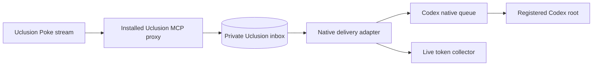

<!-- Copyright (c) 2026 Uclusion, Inc. All rights reserved. -->
# Uclusion native Codex Poke delivery

Start ordinary `codex` with the installed Uclusion MCP integration. Codex owns
its backend, frontend and native queue. Uclusion subscribes to its Poke stream
and admits messages through that existing queue; it does not launch a private
Codex app-server or relay. The supported native baseline is Codex CLI 0.160.0.

```mermaid
flowchart LR
    Cloud[Uclusion Poke stream] --> Proxy[Installed Uclusion MCP proxy]
    Proxy --> Inbox[(Private Uclusion inbox)]
    Inbox --> Native[Native delivery adapter]
    Native --> Queue[Codex native queue]
    Queue --> Root[Registered Codex root]
    Native --> Audit[Live token collector]
```

## Registration and recipient selection

The MCP proxy starts `uclusionCodexNative.py`. Its connected MCP version includes
an exact versioned digest of the configured workspace and environment. This
binds roots across proxy instances in that scope. Each proxy also retains its
random identity for its own audit and context collectors. A matching working
directory or loaded thread alone is not proof.
Subagents, detached reviews and auxiliary transcripts are not Poke recipients.

Each Poke has one recipient. Immediately before its first attempted send,
Uclusion selects the latest eligible root from native
`thread/list(sortKey=recency_at, sortDirection=desc, useStateDbOnly=true)` order,
preserving native millisecond and identity ties. Eligible roots are loaded user
conversations accepting direct input with a connected registration in the same
scope. Saved history alone is not eligibility. Failed ordering or binding checks
keep the Poke pending. All pages are inspected; displayed timestamps and file
order are never used for selection.

The private inbox has one durable scope/event stream with atomic ownership, so
concurrent proxies cannot send separate copies. Never-attempted pending Pokes
carry forward once in arrival order. Native evidence excludes copies already
admitted elsewhere; a startup cursor alone is not proof of admission. Fresh
startup excludes retained history. Explicit human-requested replay uses a
private stream. Delivery never transfers a job assignment.

Idle Codex roots wake through the native queue. Busy roots receive native
steering in their active turn without cancelling a running command. Uclusion
does not answer approval requests on Codex's behalf.

Start a turn in the conversation intended to receive Pokes, then run the
environment-correct `uclusion codex-recipients` command. It reports candidate
UUIDs, names and active/idle status, the selected root, and outstanding exact-root
receipt reconciliation. It reads native state without resuming threads, starting
delivery, changing configuration or submitting input.

After `/new`, only the latest eligible conversation receives first sends.
Frontend focus, observer resume and an older turn finishing later do not advance
native recency. A queued Poke does. `/quit` or terminal closure can leave a root
loaded in the native runtime; neither establishes that it became ineligible.
Restart and resume retain saved history, while eligibility still requires a
loaded root and connected registration. Starting a turn in the intended root
and inspecting the selection avoids relying on frontend lifetime.

## Admission and recovery

The adapter reserves each event before sending. After any send attempt, the
event, exact root and admission identity remain fixed across restart. A matching
receipt confirms admission and advances the scope stream. It does not establish
that the agent processed the message. If an outcome is uncertain, the adapter
checks the queue and conversation history for the exact admission identity.
It acknowledges a match or retries confirmed absence with the existing
1, 2, 4 and 5 second pacing. An unavailable history check keeps the event
pending. An ambiguous send is never redirected to a newer root. Selection changes
apply only to later first sends. Native client message identities do not
guarantee deduplication.

Recovery before the first conversation turn and delivery after deliberately
quitting and restarting are outside the delivery guarantee. Codex may retain
a backend or MCP process after a terminal closes. Uclusion does not change
daemon settings or terminate the shared backend to enforce frontend lifetime.

## Other launcher responsibilities

`uclusionUpdateNotices.py` retains the existing separate workspace-wide notice
state and live-process ownership. One owner checks the installed release and
queues a notice for an idle registered recipient; ordinary Poke cursors are
unchanged. Update checks run outside MCP stdout and do not block Poke delivery.

The native observer feeds `uclusionTokenAudit.py` with root and descendant
usage and turn/tool events. Collector readiness controls audit tools, and the
existing aggregate publisher includes final-response usage. Opt-in claims,
response statistics, existing credentials and receipt-owned setup cleanup
continue through the MCP registration. Installed proxy, delivery, collector
and CLI modules come from one immutable release.

## Installation and migration

Global and project installations persist the native MCP registration alongside
the resident Codex instructions. Existing users run the environment-correct
`uclusion update` from their project, then fully exit and start a fresh `codex`
session. MCP reconnect alone does not reload resident instructions.

The `uclusion codex` command is retired. Statistics are saved through
`uclusion update --response-stats PATH` or disabled with `--no-response-stats`;
omitting both preserves the installed setting. Explicit replay uses
`--deliver-existing-pokes` in the native MCP argument list and applies to later
registrations until removed. The demo and live accounting harness persist
their own settings in private directories and start ordinary Codex without
launch-only configuration overrides. Claude and Cursor keep their own delivery
workflows.
