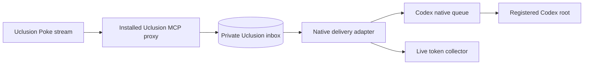

<!-- Copyright (c) 2026 Uclusion, Inc. All rights reserved. -->
# Uclusion native Codex Poke delivery

Start ordinary `codex` with the installed Uclusion MCP integration. Codex owns
its backend, frontend and native queue. Uclusion subscribes to its Poke stream
and admits messages through that existing queue; it does not launch a private
Codex app-server or relay. The supported native baseline is Codex CLI 0.160.0.

```mermaid
flowchart LR
    Cloud[Uclusion Poke stream] --> Proxy[Installed Uclusion MCP proxy]
    Proxy --> Inbox[(Private Uclusion inbox)]
    Inbox --> Native[Native delivery adapter]
    Native --> Queue[Codex native queue]
    Queue --> Root[Registered Codex root]
    Native --> Audit[Live token collector]
```

## Registration and broadcast

The MCP proxy starts `uclusionCodexNative.py`. Its unique MCP connection identity
proves which exact native roots belong to it in the selected workspace and
environment. A matching working directory or loaded thread alone is not proof.
Subagents, detached reviews and auxiliary transcripts are not Poke recipients.

Each registered root has its own cursor, scoped to its Codex home, workspace
and environment. A fresh registration starts after retained history; arrivals
during registration remain eligible. Resuming the same root continues its
cursor. Explicit human-requested replay uses an independent private cursor.
After `/new`, both the previous and new conversations remain recipients while
they stay registered. Broadcast delivery never transfers a job assignment.

Idle Codex roots wake on native admission. Busy roots process messages on their
next turn, including after review or compaction. Uclusion neither steers the
active frontend nor answers approval requests on Codex's behalf.

## Admission and recovery

The adapter reserves each event before sending. A matching queue receipt
confirms admission and advances only that root's cursor. It does not establish
that the agent processed the message. If an outcome is uncertain, the adapter
checks the queue and conversation history for the exact admission identity.
It acknowledges a match or retries confirmed absence with the existing
1, 2, 4 and 5 second pacing. An unavailable history check keeps the event
pending. Native client message identities do not guarantee deduplication.

Recovery before the first conversation turn and delivery after deliberately
quitting and restarting are outside the delivery guarantee. Codex may retain
a backend or MCP process after a terminal closes. Uclusion does not change
daemon settings or terminate the shared backend to enforce frontend lifetime.

## Other launcher responsibilities

`uclusionUpdateNotices.py` retains the existing separate workspace-wide notice
state and live-process ownership. One owner checks the installed release and
queues a notice for an idle registered recipient; ordinary Poke cursors are
unchanged. Update checks run outside MCP stdout and do not block Poke delivery.

The native observer feeds `uclusionTokenAudit.py` with root and descendant
usage and turn/tool events. Collector readiness controls audit tools, and the
existing aggregate publisher includes final-response usage. Opt-in claims,
response statistics, existing credentials and receipt-owned setup cleanup
continue through the MCP registration. Installed proxy, delivery, collector
and CLI modules come from one immutable release.

## Installation and migration

Global and project installations persist the native MCP registration alongside
the resident Codex instructions. Existing users run the environment-correct
`uclusion update` from their project, then fully exit and start a fresh `codex`
session. MCP reconnect alone does not reload resident instructions.

The `uclusion codex` command is retired. Statistics are saved through
`uclusion update --response-stats PATH` or disabled with `--no-response-stats`;
omitting both preserves the installed setting. Explicit replay uses
`--deliver-existing-pokes` in the native MCP argument list and applies to later
registrations until removed. The demo and live accounting harness persist
their own settings in private directories and start ordinary Codex without
launch-only configuration overrides. Claude and Cursor keep their own delivery
workflows.
